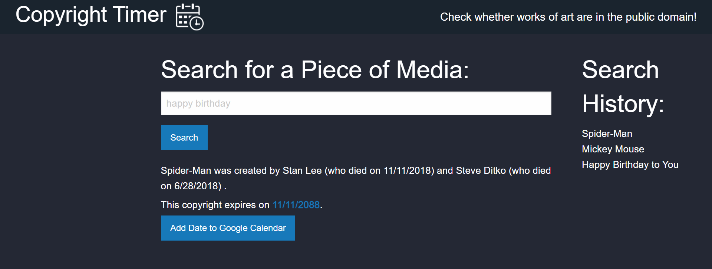

# Copyright Timer

## Description

This page lets you check whether a copyright of interest is in the public domain or not, and if not, when it will be

## Website

You can access the deployed website here:
 
https://moses-ian.github.io/copyright-timer

## Credits

### Creators:
* [Rich Arce](https://github.com/raarce118)
* [David Griffin](https://github.com/DavidTJGriffin)
* [Jeffrey Koon](https://github.com/OfficialBeez)
* [Ian Moses](https://github.com/Moses-Ian)

### Technologies Used:
* [Wikidata](https://www.wikidata.org/wiki/Special:ApiSandbox)
* [Google Calendar](https://developers.google.com/calendar/api)
* [Luxon](https://moment.github.io/luxon/#/)
* [Foundation](https://get.foundation/sites/docs/index.html)

## License

Please do not copy any of our code.

## Features

Search for a media work you're interested in!

